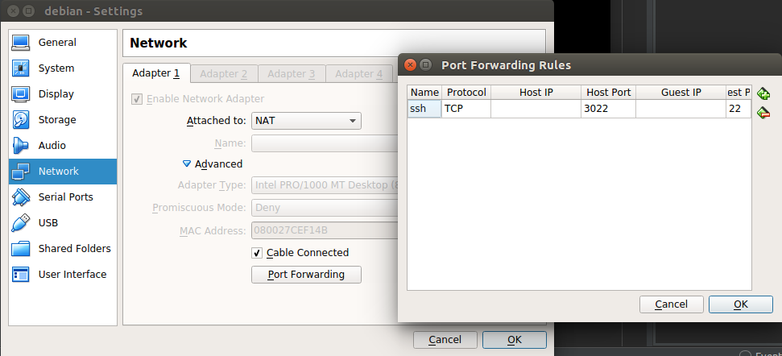

# SSH to a Debian VM
Create a VM (debian) with Debian Stretch 9. Oracle Virtual Box can be a good choice. Ubuntu is my host OS.

## Connect the guest os (Debian VM) from host (Ubuntu)

### Step 1: Install Debian in Oracle Virtual Box

To get the IP address of the guest os. (in my case: 10.0.2.15/24) (optional)
```
$ ip address

```

### Step 2: From Debian terminal remove cd-rom source location from sources.list

```
$ su -
$ nano /etc/apt/sources.list
$ apt-get update
$ apt-get install openssh-server


```
Turn off the VM


### Step 3: Enable port forwarding
Select the VM in the Virtual Box > Settings > Network > Advanced > Port Forwarding



```
Name: ssh
Protocol: TCP
Host IP:
Host Port: 3022
Guest IP:
Guest Port: 22
```


### Step 4: ssh to the VM
Start the Debian VM.
Now from host (Ubuntu) terminal. "shahjalal" is the user.
```
$ ssh shahjalal@127.0.0.1 -p 3022
shahjalal@127.0.0.1's password:
Linux shahjalal 4.9.0-8-amd64 #1 SMP Debian 4.9.130-2 (2018-10-27) x86_64

The programs included with the Debian GNU/Linux system are free software;
the exact distribution terms for each program are described in the
individual files in /usr/share/doc/*/copyright.

Debian GNU/Linux comes with ABSOLUTELY NO WARRANTY, to the extent
permitted by applicable law.
Last login: Mon Dec 10 16:05:26 2018 from 10.0.2.2
$
$
$
shahjalal@shahjalal:~$ ip address
1: lo: <LOOPBACK,UP,LOWER_UP> mtu 65536 qdisc noqueue state UNKNOWN group default qlen 1
    link/loopback 00:00:00:00:00:00 brd 00:00:00:00:00:00
    inet 127.0.0.1/8 scope host lo
       valid_lft forever preferred_lft forever
    inet6 ::1/128 scope host
       valid_lft forever preferred_lft forever
2: enp0s3: <BROADCAST,MULTICAST,UP,LOWER_UP> mtu 1500 qdisc pfifo_fast state UP group default qlen 1000
    link/ether 08:00:27:ce:f1:4b brd ff:ff:ff:ff:ff:ff
    inet 10.0.2.15/24 brd 10.0.2.255 scope global enp0s3
       valid_lft forever preferred_lft forever
    inet6 fe80::a00:27ff:fece:f14b/64 scope link
       valid_lft forever preferred_lft forever
shahjalal@shahjalal:~$
shahjalal@shahjalal:~$
shahjalal@shahjalal:~$
```

